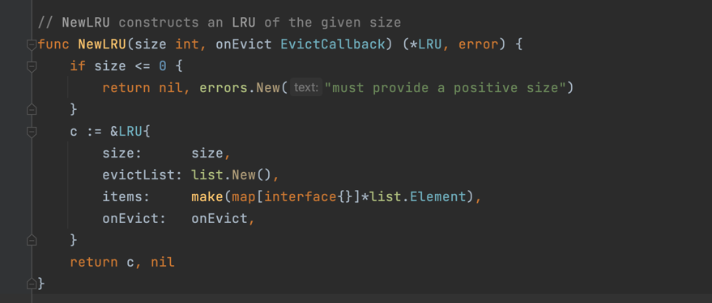
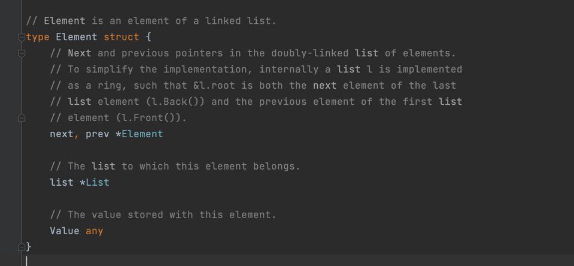

# LRU
最近最少使用(最长时间)淘汰算法（Least Recently Used）。LRU是淘汰最长时间没有被使用的页面

# LFU
最不经常使用(最少次)淘汰算法（Least Frequently Used）。LFU是淘汰一段时间内，使用次数最少的页面

# golang-lru

golang-lru是一个基于双向链表实现的线程安全LRU缓存工具，若数据已经在缓存中，将其移到队首，并返回结果。若数据不在缓存中，将新记录添加到队首。若缓存超长，清理队尾缓存数据。

# evict
test: lru_evict.go
# not evict
test: lru_not_evict.go
# thread safe
test: lru_thread_safe.go