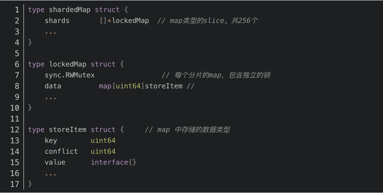
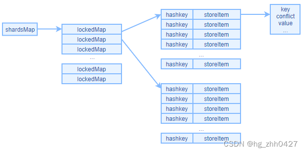
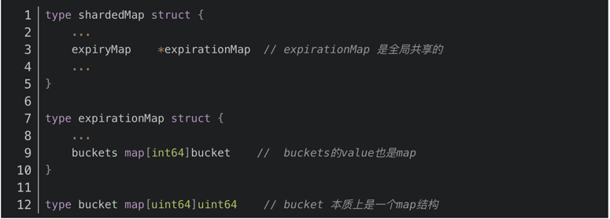

# 存储策略
Ristretto中的分片字典

# 过期策略

对于以上结构buckets的key是时间戳。bucket中的key和 value则 分别存储是keyHash和conflictHash值,对每一个时间戳除5取整，得到buckets中的key，然后将keyHash 和conflictHash 分别作为bucket的key和value。
删除过期key:有个定时器，定时周期为2s执行CleanUp() 函数，扫描出5秒前过期的key。

# 淘汰策略
Sampled意为采样，SampledLFU从众多数据中随机的选取部分数据，并将待缓存的数据与这些数据做比较，如果发现采样到的数据的被访问次数都大于待缓存数据被访问的次数，则认为该数据不值得被缓存。
TinyLFU:对一个key我们会取他的hash值，找到对应位置，然后累加得到访问次数。一个hash函数会冲突是比较低的，多搞4个hash函数，4个都冲突的概率就微乎其微了。取这4个hash函数对应值的最小的那个，基本就是访问次数了。

# Test
capacity.go

expire.go
